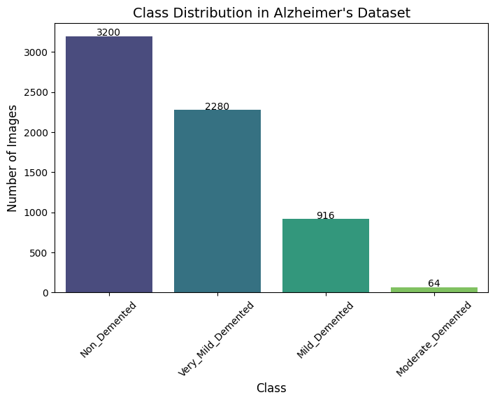
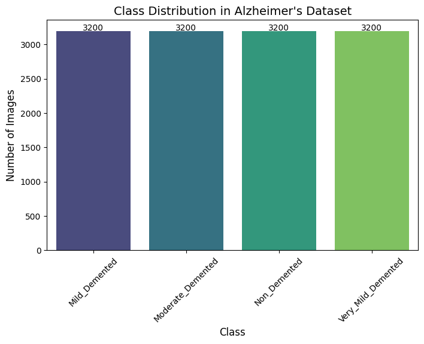
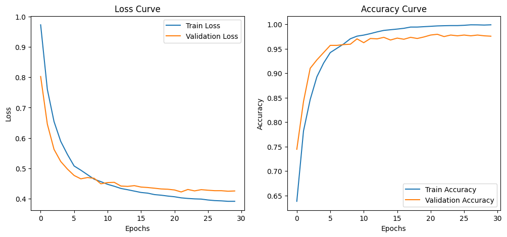
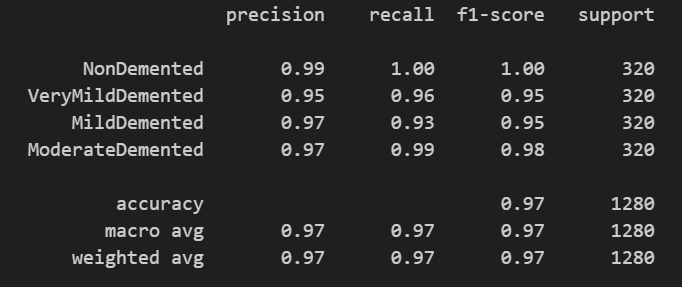
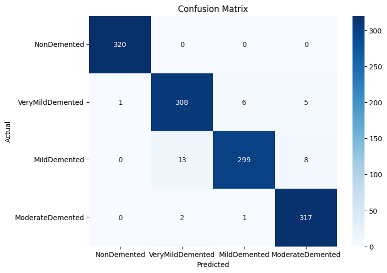
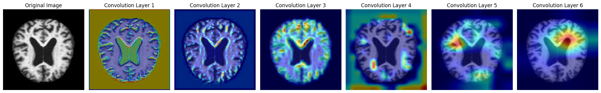

# 🧠 Alzheimer's Disease Detection using MRI Scans


## 🚀 Live Demo
Experience the model in action:  
## [Alzheimer's Detection Web App](https://huggingface.co/spaces/Shashank-pericherla/Alzheimers-Detection-ML)

---

## 📌 Project Overview
Alzheimer’s disease is a progressive neurodegenerative disorder affecting millions worldwide. This project utilizes **Deep Learning (CNN)** to classify MRI brain scans into different stages of Alzheimer’s disease. The model is designed for **early detection**, aiding research and potential medical analysis.


### 🔍 Features
- **Multi-Class Classification** of MRI scans into various Alzheimer’s stages.
- **Custom CNN Model** optimized for high accuracy.
- **Grad-CAM Visualization** for interpretability.
- **Robust Data Augmentation** to tackle class imbalance.
- **Interactive Web App** built with **Streamlit**.

---

## 🖼️ Dataset & Preprocessing
The dataset contains MRI scans categorized into four classes:
- **Non-Demented** 🟢
- **Very Mild Demented** 🟡
- **Mild Demented** 🟠
- **Moderate Demented** 🔴


### 🏗 Data Balancing & Augmentation
The dataset was highly imbalanced, requiring augmentation techniques such as:
- **Rotation, Zooming, Flipping, Contrast Adjustments**
- **Synthetic Data Generation** for underrepresented classes

📊 **Data Distribution Before & After Balancing:**

|  |  |
|:---------------------------------------------:|:---------------------------------------------:|
| **Before Augmentation** | **After Augmentation** |

---

## 📈 Model Architecture
A **6-layer CNN model** with Batch Normalization and Dropout was designed for feature extraction and classification. Key components include:
- **Convolutional Layers** for spatial feature learning
- **Max Pooling** for dimensionality reduction
- **Fully Connected Layers** for classification

🔧 **Model Training Performance**

|  |
|:----------------------------------------------------:|
| **Training & Validation Loss/Accuracy** |

---

## 🎯 Evaluation Metrics
The model was evaluated using:
- **Accuracy, Precision, Recall, F1-score**
- **Confusion Matrix for Class-wise Performance**
- **Grad-CAM Heatmaps for Model Explainability**

📌 **Performance Overview**

|  |  |
|:----------------------------------------------------------:|:------------------------------------------------:|
| **Classification Report** | **Confusion Matrix** |

---

## 🔍 Explainability with Grad-CAM
To ensure **model interpretability**, Grad-CAM visualizations highlight the key regions influencing predictions.

|  |
|:----------------------------------:|
| **Grad-CAM Output** |

---

## 🚀 How to Run Locally
### 🔧 Prerequisites
Ensure you have Python and the required dependencies installed:
```bash
pip install -r requirements.txt
```
### ▶ Run the Web App
```bash
streamlit run app.py
```

---

## 🏆 Results & Insights
- **Achieved over 97% accuracy** on testing data.
- **Test Accuracy: 97%**
- **AUC Score: 0.9985**
- **Calibration Error: 0.0484**
- **Grad-CAM heatmaps** provide reliable explainability for diagnosis.
- **Augmentation significantly improved performance** on underrepresented classes.

---

## 📌 Future Improvements
- Implementing **Transformer-based Vision Models** for better performance.
- Integrating **3D MRI Analysis** to enhance feature extraction.
- Deploying the model on **cloud-based medical platforms**.

---

## 📂 Repository Structure
- **`src/`** → Python scripts for model training, evaluation, and inference.
- **`notebooks/`** → Jupyter notebooks for EDA, training, and evaluation.
- **`saved_models/`** → Trained models (`.pth` format).
- **`results/`** → Accuracy reports and calibration plots.

## 🔧 Installation
Clone the repository and install dependencies:
```bash
git clone https://github.com/Shashank-Pericherla/Alzheimers-Detection-ML.git
cd Alzheimers-Detection-ML
pip install -r requirements.txt
```

## 🤝 Contributing
Contributions are welcome! Feel free to fork the repo, report issues, or submit PRs.

---

## 📜 License
This project is licensed under the **MIT License**.

🔗 **Stay Connected:** [LinkedIn](https://www.linkedin.com/in/geetha-shashank-pericherla/) | [GitHub](https://github.com/Shashank-Pericherla) | [Website](#)

---

### ⭐ If you found this project helpful, give it a star! ⭐

